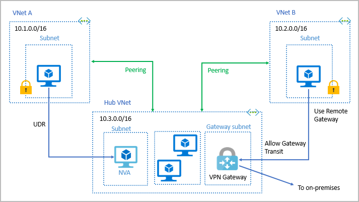

# [Explore Azure networking services](https://docs.microsoft.com/en-us/learn/modules/azure-networking-fundamentals/)

## Azure Virtual Network Fundamentals

- An Azure network is a set of resources that links other Azure resources, enabling different resources to communicate with each other, on cloud and on-premises computers.

- Key networking capabilities:

  - Isolation and segmentation:

    - Create multiple isolated networks.
    - When creating a VNet, it can be defined a private IP address space, by using public or private IP address ranges.
    - This address space can be then divided into subnets and allocate part of the defined address space to each named subnet.
    - For name resolution, Azure's has a built in resolution service, or users can configure and use an internal or external DNS server.

  - Internet communications:

    - Enable incoming connections to a VM from the Internet by defining a public IP address or a public load balancer.
    - For management you can connect with Azure CLI, Remote Desktop Protocol, or Secure Shell.

  - Communication between Azure resources:

    - Virtual networks
      - They can connect multiple Azure resources, such as VMs, App Service Environment for Power Apps, Azure Kubernetes Service, and Azure VM scale sets.
    - Service endpoints
      - They can connect other resources types such as Azure SQL databases and storage accounts.
      - Enables linking multiple Azure resources to virtual networks to improve security and provide optimal routing.

  - Communication with on-premises resources.

    - Create a network that spans both local and cloud environments.
    - Point-to-site virtual private networks
      - An encrypted VPN connection from the client computer to Azure.
    - Site-to-site virtual private networks
      - Links on-premises VPN device/gateway to the Azure VPN gateway in a virtual network.
      - The devices in Azure appear as being on the local network.
    - Azure ExpressRoute
      - For environments that need a lot of bandwidth and high levels of security.
      - Provides dedicated private connectivity to Azure that doesn't travel over the Internet.

  - Route network traffic:

    - Route tables
      - Define rules about how traffic packets should be directed through the Internet, and between subnets.
    - Border Gateway Protocol
      - Works in Azure VPN gateways or ExpressRoute to propagate on-premises [BGP]([Border Gateway Protocol - Wikipedia](https://en.wikipedia.org/wiki/Border_Gateway_Protocol)) routes to Azure virtual networks.

  - Filter network traffic:

    - Network security groups
      - An Azure resource that can contain multiple inbound and outbound security rules to allow or block traffic.
      - Filter based on factors such as source and destination IP address, port, and protocol.
    - Network virtual appliances
      - Specialized VM that can be compared to a [hardened network]([Hardening Network Devices (menog.org)](https://www.menog.org/presentations/menog-11/49-Hardening_Network_Devices-tutorial-V1.5-WOV.pdf)) appliance.
      - It carries out a particular network function such as running a firewall or performing [WAN]([Wide area network - Wikipedia](https://en.wikipedia.org/wiki/Wide_area_network)) optimization.

  - Connect virtual networks:

    - Link virtual networks together by using virtual network peering.
    - This enables resources in each VNet to communicate with each other.
    - UDR (user-defined Routing) allows control of the routing tables between subnets within a subnet as well as other VNets.

    
